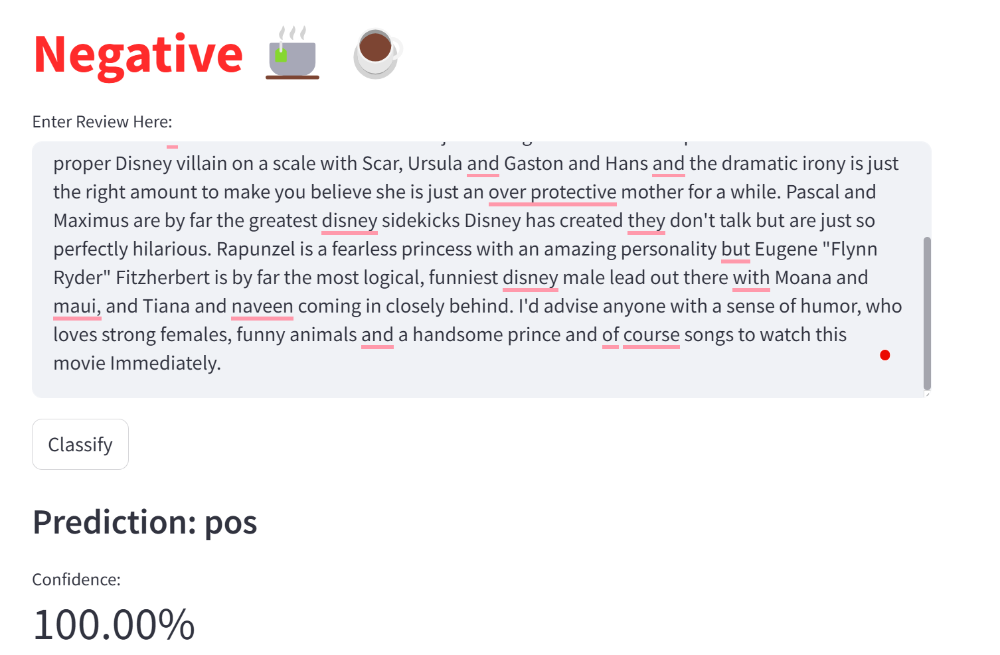
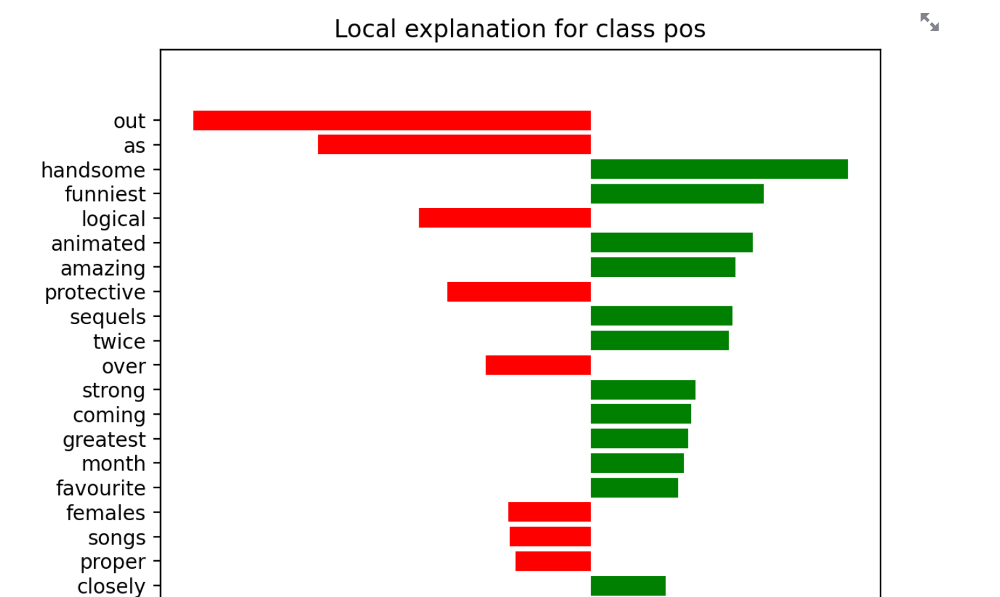

# NLP Movie Review Classification

This project aims to classify movie reviews using natural language processing (NLP) techniques. The classification model is built using the Naive Bayes classifier with TF-IDF vectorization. The project utilizes a variety of NLP techniques to process text data, train a model, and make predictions on movie reviews.

## Table of Contents

- [Project Overview](#project-overview)
- [Setup and Installation](#setup-and-installation)
- [Model Training](#model-training)
- [Usage](#usage)

## Project Overview

The primary goal of this project is to classify movie reviews into predefined categories (e.g., positive or negative). The following steps are carried out in the project:

1. **Preprocessing**: Tokenization, stopword removal, and lemmatization are applied to clean the text.
2. **Vectorization**: TF-IDF vectorizer is used to convert text data into numerical representations.
3. **Model Training**: The Multinomial Naive Bayes classifier is trained using the processed text data.
4. **Prediction**: The trained model is used to classify unseen movie reviews.

## Technologies

- Python 3.8+
- Libraries:
  - `numpy`
  - `pandas`
  - `scikit-learn`
  - `nltk`
  - `lime`
  - `joblib`

## Setup and Installation

Follow the instructions below to set up and run the project.

### 1. Clone the repository

```bash
git clone https://github.com/your-username/movie-review-classifier.git
cd movie-review-classifier
```

### 2. Set up a Python virtual environment (optional but recommended)

If you're not already using a virtual environment, create one by running:

```bash
python -m venv myenv
```

Activate the virtual environment:

- **Windows:**

```bash
myenv\Scripts\activate
```

- **macOS/Linux:**

```bash
source myenv/bin/activate
```

### 3. Install dependencies

Install the required Python libraries by running:

```bash
pip install -r requirements.txt
```

### 4. Download the dataset

Make sure to download the dataset containing movie reviews and save it in the project folder.

## Model training

### 1. Data Preprocessing

The text data undergoes preprocessing steps including:

- **Tokenization**: Splitting text into words or tokens.
- **Decapitalization**: Decapitalizing words
- **Stopword Removal**: Removing common words that don't contribute much to the classification task.
- **CAP word removal**: Removing words in CAPITAL letters
- **Salutation removal**: Removing salutations such as Mr., Ms., etc.
- **Number removal**: Removing numbers
- **Lemmatization**: Reducing words to their base form.

### 2.Vectorization

TF-IDF vectorizer is used to convert the processed text into numerical features that can be used by the machine learning model.

### 3. Model Training

Multiple models are trained (Logistic Regression, Naive Bayes, and Random Forest) and results are compared _(as can be seen in ./notebooks/research2.ipynb)_. The best model (Naive Bayes) is selected with Accuracy, Balance Accuracy and F1-score at 0.85. The model is then tunned for better performance, raising the accuracy to 0.865

The Naive Bayes model is trained on the vectorized data, which works well with discrete features like word counts.

### 4. Save Model and Vectorizer

The trained model and vectorizer are saved as nb_model.joblib and vectorizer.joblib using joblib for later use in the prediction phase.

## Usage

### 1. Preprocess the data and Train the model

The _./src/classifier.py_ script is used for cleaning and processing the raw text data, including tokenization and lemmatization, then train the classifier.
The whole process can be called from main.py script:

```bash
python main.py
```

### 2. Run dashboard on Streamlit

Movie reviews can be categorized directly via an interactive dashboard which shows the category of the review (positive/negative) with confidence level and analysis. Illustration can be found below.
Link to the Streamlit app:
The app can also be called locally by running:

```bash
streamlit run ./app/review_classifier.py
```



